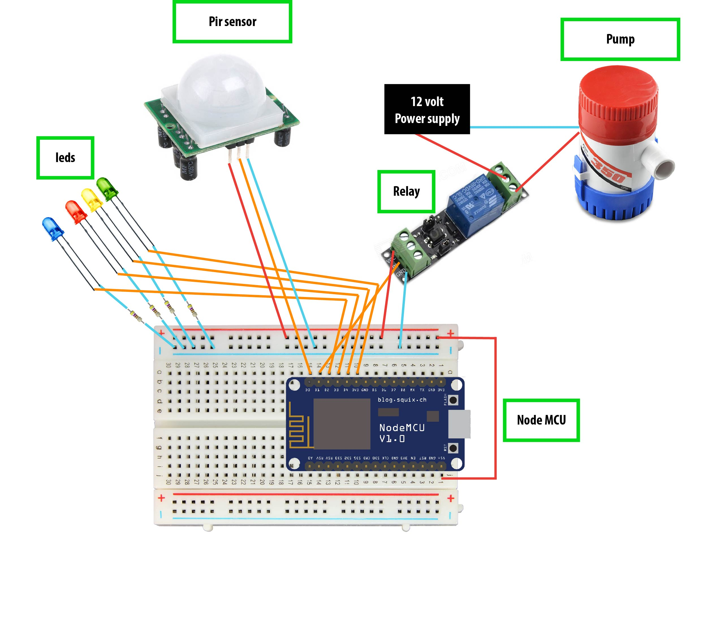
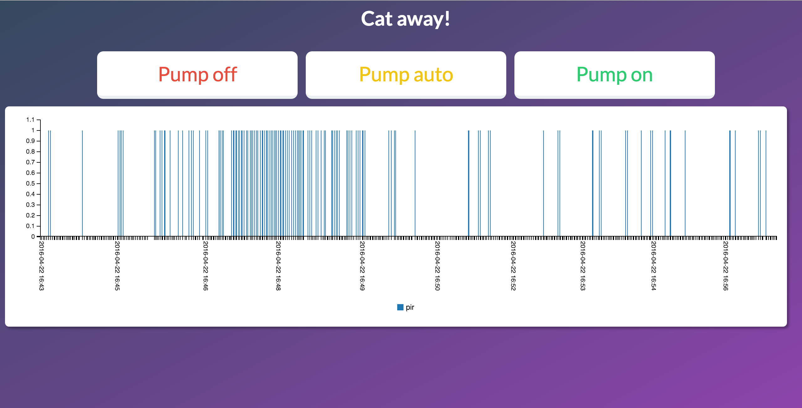

# How kan I scare away cats form the countertop when im not home or asleep with a Node MCU?

## Intro

For this project I will try to design a machine that will automaticaly shoo away cats with water. To do this I'm using a Node MCU. The benefit of this device is the build in wifi module. With this I will try to turn it off and on over the internet so the device will not fire when I want to enter the kitchen.


## Items

- Node MCU [(Hacker Store)](http://www.hackerstore.nl/Artikel/806) 
- Water pump [I used Liquid Pump 350GPH (12v)](https://www.sparkfun.com/products/10455)
- Relay [DX.com](http://www.dx.com/p/5v-relay-isolation-control-module-147941)
- PIR Sensor [Hacker store](http://www.hackerstore.nl/Artikel/7)
- 12 volt power supply
- Some rubber hose
- 4 leds + resistors
- wires

## Wiring the Node MCU

The code on the Node is C# and will be written in the code editor from [Arduino](https://www.arduino.cc/en/Main/Software). 



It's a complex drawing but i'm going to explain it based on the digital in/outputs of the Node. 

### D0: PIR Sensor
The PIR sensor will be looking for movement on the countertop of my kitchen. To do this I used the following basic code:

```
int pirPin = D0;

void setup() {
  Serial.begin(9600);
}

void loop() {
  pirVal = digitalRead(pirPin); //read state of the PIR
  Serial.println(pirVal); // print value
}
```

### D1: Relay	and pump
The relay is necessary to switch on the power to the pump because it needs 12 volts of power which the Node can't provide. Here is the code to switch the relay: 

```
int relPin = D1;

void setup() {
  pinMode(relPin, OUTPUT);
}

void loop() {
	digitalWrite(relPin, HIGH); // to switch the relay off!
	digitalWrite(relPin, LOW); // to switch the relay on! 
}

```

### D2,3,4: Status leds

This leds will be used to show users the status of the system. Red will mean the system is off, green is for manual activating the system and yellow will glow when the PIR sensor is active.


### D5: Pir status

I used the last led for visualising the state of the PIR sensor. This is more for debuging than real functionality.

## WiFi

The node module comes with wifi right out of the box but to use it we need to include the ESP8266WiFi library. This can be dowloaded from the Arduino editor. 

To use the WiFi libray we need to include it in or code.

```
#include <ESP8266WiFi.h>

char ssid[] = "network name";
char pass[] = "password";
WiFiClient  client;

void setup() {
  Serial.begin(9600);

  while (WiFi.status() != WL_CONNECTED) {
     delay(500);
     Serial.print(".");
  }
}
```

When the Node is connected the Serial will stop printing dots and run the code after the wile loop.

## Sending data from the Node

To see how many times and when the sensor noticed movement we want to send data to or web interface where we can visualize the data we need.
To do this I'm using a post message to send data to my server.

```
#include <ESP8266HTTPClient.h>

void loop() {
 HTTPClient http;
  
 // Post Event
 String data;
 String pir;
 pir = String(digitalRead(D0));

 data = "pir="+pir;

 if (client.connect(host, httpPort)) {
   //make the POST headers and add the data string to it
   client.println("POST /iot2/index.php HTTP/1.1");
   client.println("Host: www.caffeine-works.nl:80");
   client.println("Content-Type: application/x-www-form-urlencoded");
   client.println("Connection: close");
   client.print("Content-Length: ");
   client.println(data.length());
   client.println();
   client.print(data);
   client.println();
   Serial.println("Sended data:" + data);

 } else {
   Serial.println("Something went wrong");
 }
}

```
To connect to the server we use another ESP library: ESP8266HTTPClient. This gives us the possibility to send and receive data. 

## Getting data from the server

In order to switch the sensor off and on we need to get a text file from the server. This can be done with the same library as the post request.

```
#include <ESP8266HTTPClient.h>

void loop() { 
 HTTPClient http;
	
 http.begin("http://caffeine-works.nl/iot2/pir.txt"); 
 int httpCode = http.GET();        
 String payload = http.getString();
	
 Serial.println("Server: " + payload);
}
```

If we put al this code together we have a working Node MCU. The entire code I used for my project is in the github files. The only thing we need to do is setup the website from where we are going to send commands and receive data.

## The server

For the server side code I used PHP because it is relatively easy to learn and almost every server can procces it. first we write the function that can chance the text file the Node is reading to see what task it needs to perform.

```
<?php  
$light = $_GET['light'];
if($light == "on") {  
  $file = fopen("lampje.txt", "w") or die("can't open file");
  fwrite($file, 'on');
  fclose($file);
} 
else if ($light == "off") {  
  $file = fopen("lampje.txt", "w") or die("can't open file");
  fwrite($file, 'off');
  fclose($file);
}
else if ($light == "auto") {  
  $file = fopen("lampje.txt", "w") or die("can't open file");
  fwrite($file, 'auto');
  fclose($file);
}
?>
```

To use this function we need to chance the URL with a simpel 'link' tag:

```
<a href="?light=off">Pump off</a>
<a href="?light=auto">Pump auto</a>
<a href="?light=on">Pump on</a>
```

## data visualisation

To get the data that the Node is trying to post we need another PHP function:

```
<?php 
    if ($_SERVER["REQUEST_METHOD"] === "POST") {

      $data = $_POST["pir"];

      $timestamp = new DateTime();
      $time = $timestamp->format('Y-m-d H:i:s');
      
      $message = array("time" => $time, "pir" => $data);

      $inp = file_get_contents('test.json');
      $tempArray = json_decode($inp);
      array_push($tempArray, $message);
      $jsonData = json_encode($tempArray);
      file_put_contents('test.json', $jsonData);

    }
?>

```

This will write the data to a json file on or server. To visualise this data I used javascript with the library [C3.js](c3js.org).

```
var dataa=[];
var dates=[];
var values=[];

$.getJSON( "test.json", function(data) {
    dataa = data;

    for (var i = 0; i < dataa.length; i++) {
        dates.push(dataa[i].time);
        values.push(dataa[i].pir);
    }
    dates = dates.reverse();
    dates = dates.slice(0,499);
    dates.push("x");
    dates = dates.reverse();
    values = values.reverse();
    values = values.slice(0,499);
    values.push("pir");
    values = values.reverse();

    var chart = c3.generate({
        data: {
            x: 'x',
            xFormat: '%Y-%m-%d %H:%M:%S',
            columns: [
                dates,
                values
            ],
            type: 'bar',
        },
        axis : {
            x : {
                type : 'timeseries',
                tick: {
                    rotate: 90,
                    format: '%Y-%m-%d %H:%M'
                  //format: '%Y' // format string is also available for timeseries data
                }
            }
        }
    });
});
```
First I needed to rearrange the data to the C3 format but after that it pretty straight forward to use C3 from the starters guild on the website. 

And here is the result for the website:



If you have any questions or sugestions please dont hesitate to contact me!

Thanks for reading. 


