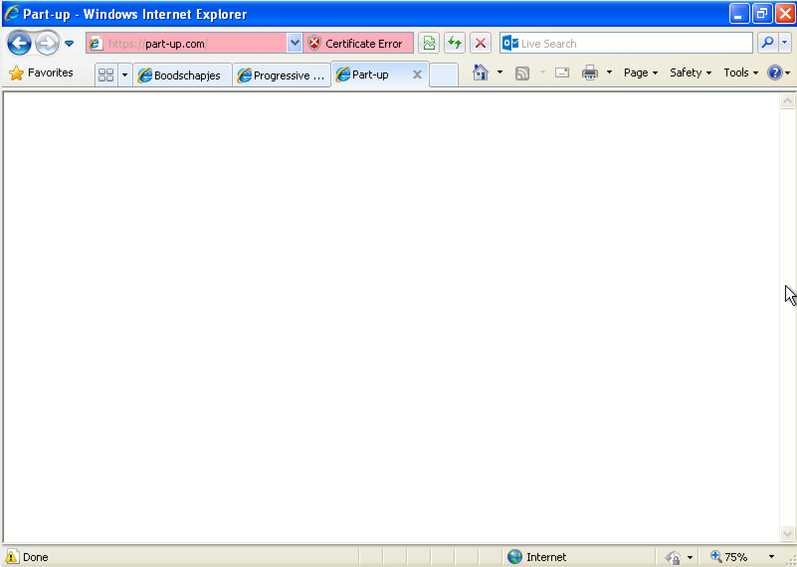
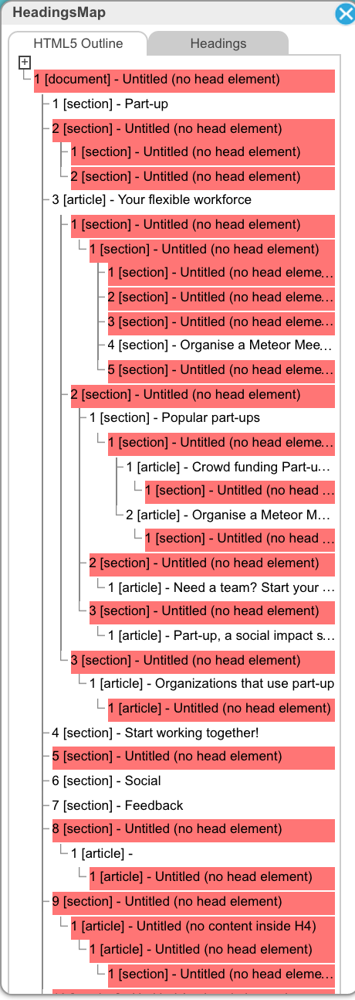
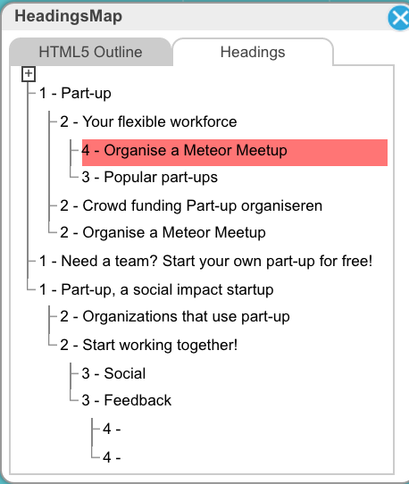

# Part-up.com debug & optimise

## De opdracht
De opdracht die ik van Lifely gekregen heb is om de website Part-up.com sneller te maken. Hierbij is het de bedoeling dat ik de technieken gebruik die besproken zijn in de de vakken Browser Technologies en Performance Matters.

## Analyse

### afbeeldingen
Nog niet alle afbeeldingen op de website zijn optimaal voor het web. Door deze te verkleinen zal de laadtijd van de site korter worden omdat er minder gedownload hoeft te worden.

### First meaninful render
Tot dat alle content gedownload is ziet de gebruiker alleen maar een wit scherm. Op langzaam internet kan dat oplopen tot een halve minuut of meer.

### Caching
De website maakt al gebruik van caching maar nog niet optimaal. 

### Javascript
De website laat helemaal niets zien als javascript niet of niet goed wordt ingeladen. Dit is onduidelijk voor gebruikers.

In IE8 bijvoorbeeld voerd het hele script niet uit:   

### semantiek
De semantiek op de website klopt op veel plekken niet. Dit maakt het voor veel screenreaders lastig om de structuur van de pagina te bepalen.  

  
Volgens de [w3c regels](https://www.w3.org/TR/html5/dom.html#flow-content-1) moeten sections altijd met een heading beginnen. Op deze manier kunnen screenreaders beter door de content heen gaan.

## Verbeteringen

### Afbeeldingen
Alle statische afbeeldingen die op de website te vinden zijn zijn samen 2.5 MB. Door deze afbeeldingen te optimaliseren heb ik hier 600 KB vanaf kunnen halen zonder qualiteit te verliezen. Dit lijkt niet heel veel, maar als je honderden of duizenden pagina's per dag moet verzorgen loopt het snel op.

Naast de statische afbeeldingen zijn er ook nog afbeeldingen die door de gebruikers geupload worden. Deze kunnen ook nog kleiner gemaakt worden. Om dit te doen zal er serverside een extra tool gebruikt moeten worden zoals [Smash.it](https://developer.yahoo.com/blogs/ydn/automatically-compressing-s3-images-using-smush-14941.html).

### First meaningful render
Om de First meaningful render sneller te krijgen is een van de belangrijkste verbeteringen voor de app.

De plugin fast-render.  
Normaal laad meteor eerst de style van de website in, daarna alle javascript, en daarna alle bestanden die de hele applicatie kan geberuiken. Wat fast-render doet is als eerst de bestanden mee geven die voor de opgevraagde pagina nodig zijn zodat die pagina gerenderd kan worden, daarna laad hij de rest pas in.

Nadat ik dit heb toegevoegd is de first meaningful render van 51 seconden aar 47 seconden gegaan.

### cashing
Om beter gebruikt te maken van caching kan is het mogelijk om de Meteor plugin [Appcache](https://atmospherejs.com/meteor/appcache) te gebruiken. Met deze plugin wordt er automatisch

### Javascript
Om het probleem op te lossen van de lege pagina bij het niet inladen van de javascript is het mogelijk om op de server een statische pagina te renderen en die als eerst naar de client te sturen.

## Aanbevelingen

### semantiek
De semantiek kan een stuk beter op de website. Ik raad aan om de [chrome plugin HeadingsMap](https://chrome.google.com/webstore/detail/headingsmap/flbjommegcjonpdmenkdiocclhjacmbi?hl=en) te gebruiken om de structuur van de headings in orde te maken. 

### Javascript
Zonder javascript doet de applicatie helemaal niets. Dit is relatief makkelijk op te lossen doormiddel van serverside rendering. Met de [plugin SSR](https://atmospherejs.com/meteorhacks/ssr) kun je Blaze templates serverside laten renderen, daarna stuurt hij de platte html naar de client. Op deze manier weet je zeker dat 100% van je bezoekers de website goed te zien krijgen en ben je minder afhankelijk van de hardware en internetsnelheid van de gebruiker.

## Resultaat

(getest op 750kb/s Download, 250kb/s upload & 100ms latency)

### Home page 
(cache disabled)  

|                            |Base  |Optimised|
|---------------------------:|------|---------|
|**Page size**               |5.0 MB|   3.0 MB|
|**First Meaningful Render** |77.0 S|  46.0 S |
|**Total loadtime**          |91.0 S|  54.7 S |

Met cache uit wordt de website sneller gerenderd doordat fast-render de data sneller bij de client gerenderd wordt.

### Home page 
(cache enabled)  

|                            |Base  |Optimised|
|---------------------------:|------|---------|
|**Page size**               |5.0 MB|511 KB   |
|**First Meaningful Render** |68.8 S| 3.3 S   |
|**Total loadtime**          |78.6 S|12.3 S   |

Met de cache aan is er pas echt veel verschil. Appcache zorgt er voor dat de website meteen vanuit de cache geladen zodat hij bijna meteen wordt weergegeven. Daarna gaat hij checken of er veranderingen in de live versie zijn om te overschrijven.

