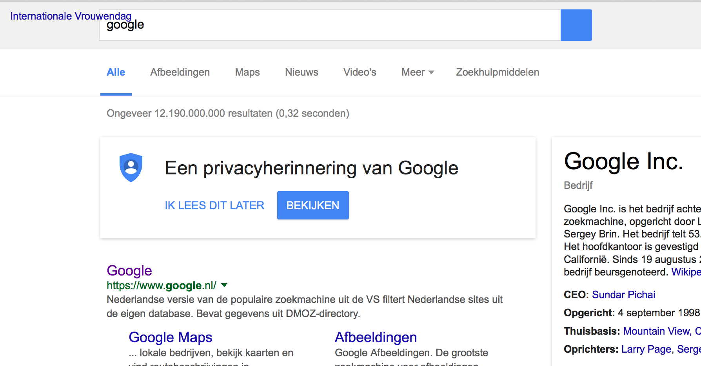
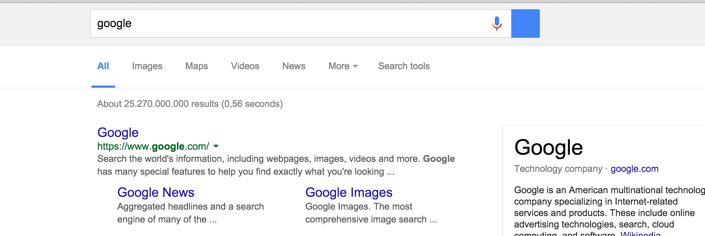

# Onderzoek voor Browser Technologies week 1

## Afbeeldingen

Ik ben begonnen met de vraag: Hoe preformen sites die ik gebruik als er geen afbeeldingen ingeladen worden?

### Hoe heb ik dit gedaan?
Browser plugin voor [Google Chrome](https://chrome.google.com/webstore/detail/block-image/pehaalcefcjfccdpbckoablngfkfgfgj) en [Firefox](https://addons.mozilla.org/nl/firefox/addon/image-block/).

### Bevindingen
Tijdens mijn onderzoek ben ik 2 soort websites tegen gekomen.
1. Websites met tekst content
2. Websites met afbeelding content

Mijn web-gebruik begint vaak bij google. Ondanks dat het logo niet laad. zijn de core functies van google gewoon zichtbaar. De zoekresultaten zijn text-based. Dit geld ook voor stackoverflow. Ook de grote nieuwssites gaan niet 'stuk' zonder afbeeldingen. 

Wat mij opviel was dat er voor geen een website die ik heb bezocht er een fallback was ingebouwd voor deze plugins. (Dit kan ook te maken hebben gehad met de manier waarop de plugin in google chrome de afbeeldingen blokeerd. In Firefox kreeg ik soms wel een 'alt-text' te zien maar meestal niet.)

Alt tekst in Firefox

Alt tekst in Google Chrome

### Lezen

## Breedband internet

Traag internet bestaat niet! Toch? 

### Hoe heb ik dit gedaan?
Het programma [Charles](www.charlesproxy.com) gebruikt om mijn internet snelheid te beperken

### Lezen

