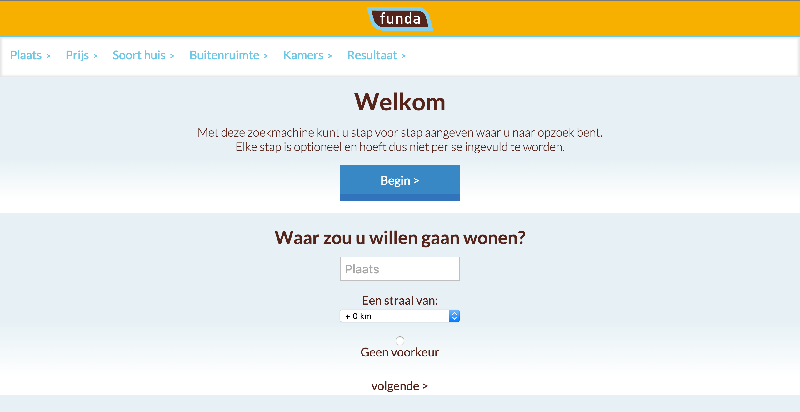
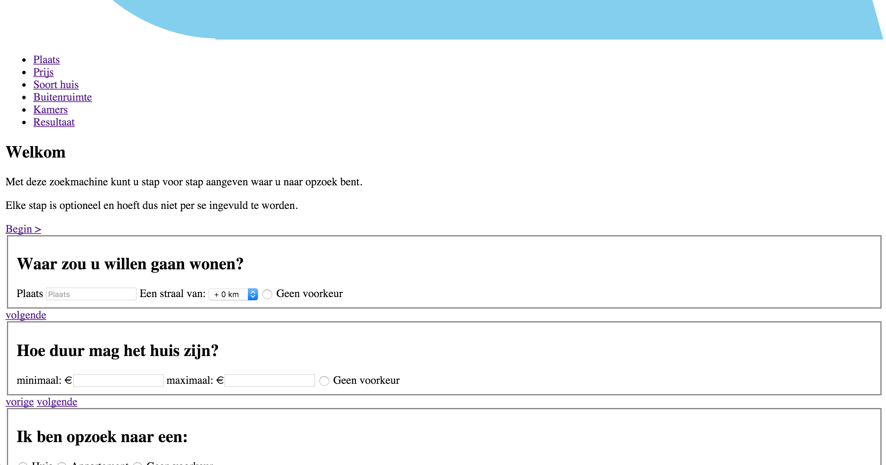

#Progressive enhancement - Funda SPA

## Huidige status:

### Javascript uit
Tijdens het testen van mijn app ben ik als eerst aangelopen tegen het feit dat de zoekfunctie alleen doormiddel van JS te gebruiken is. Ook verbergt hij de pagina's niet die niet weergegeven horen te worden.

### Afbeeldingen uit
Als er geen images worden ingeladen is de web app ook zeker niet stuk. Het enigste wat er mist is het logo en de afbeeldingen van de huizen.

### CSS uit
Op het moment dat ik de CSS uit heb gezet bleek het verbergen van de pagina's ook niet meer te werken. Dit komt omdat dat gebeurd met een class die wordt gestyled in de css file. De web app gaat hier niet op stuk, hij blijft wel werken.

### Kleur
In zwart/wit is de website nogsteeds duidelijk. Met de kleurenblindheids filters blijft het contrast ook nog goed op de hele app.

### Breedband internet
De web app doet het erg goed op traag internet (laadtijd 130ms op 50kb/s). de reslultaten ophalen gaat veel langzamer. Hier zit wel een spinner, die aangeeft dat er iets geladen wordt. Vervolgens laat hij ook eerst de HTML in en daarna pas de plaatjes.

### Tab navigatie
Tab navigatie werkt goed op de website. Alleen moet je nu op elke pagina als eerst door de navigatie/breadcrums heen tabben om bij de content te komen.

### Custom Fonts, Cookies, Local storage, CDN
Deze onderdelen heb ik allemaal niet in de applicatie verwerkt, dus dit heeft geen invloed.

