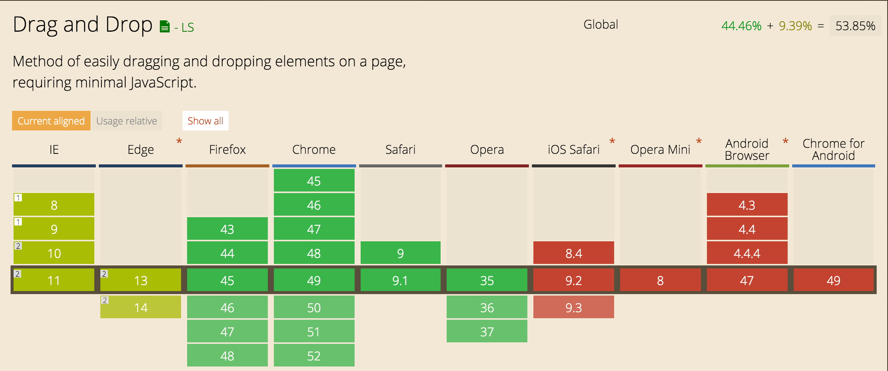

# Ik wil boodschappen-om-tostis-te-maken in mijn boodschappenlijstje kunnen gooien - Drag Drop

[link](http://tinyurl.com/leanderbt)

## een beschrijving van de feature(s)/Browser Technologies

Met de HTML5 api drag and drop kun je content verplaatsen en ergens droppen. Doormiddel van javascript kun je de events: drag, dagend, dragenter, dragexit, dragleave, dragover, dragstart en drop gebruiken. 

## welke browser de feature(s) wel/niet ondersteunen

Ios, Opra en Android ondersteunen deze api niet. IE en Edge maar gedeeltelijk.
Het is dus belangrijk om de API als feature te gebruiken, ik ben er dus eerst vanuit gegaan dat drag and drop er niet was.

##een beschrijving van de accessibility issues die zijn onderzocht

Ik ben Mobile first begonnen met ontwerpen. omdat drag and drop niet wordt ondersteund op IOS, Android en Opra mini heb ik bij de mobiele layout geen rekening gehouden met drag and drop. 
Pas als de 2 kolommen naast elkaar komen te staan kan er pas drag and drop gebruikt worden.

# Progressive Enhancement

## HTML (PHP)

Als er geen CSS en JS kan worden ingladen worden de functie van het toevoegen van de producten aan de lijst afgehandeld op de server. (dit gebeurd nu niet omdat er geen server aanwezig is om dit op te doen.) Uiteraard is er ook geen drag and drop beschikbaar zonder JS.

## CSS

De eerste enhancement is CSS. Hiermee wordt de layout overzichtelijker en kunnen de kolommen naast elkaar komen te staan. Ik heb gekozen om floats en display inline-block te gebruiken zodat ook de browsers zonder flexbox ondersteuning de juist layout's te zien krijgen.

## Javascript

Voor nu, met JS is het mogelijk om producten toe te voegen en af te strepen van de lijst. Het is de bedoeling dat dit serverside gaat gebeuren.

## Drag and Drop

Als drag and drop ondersteund wordt dan komt het 'drop veld' in de lijst te staan en is het mogelijk om producten daar in te slepen.

