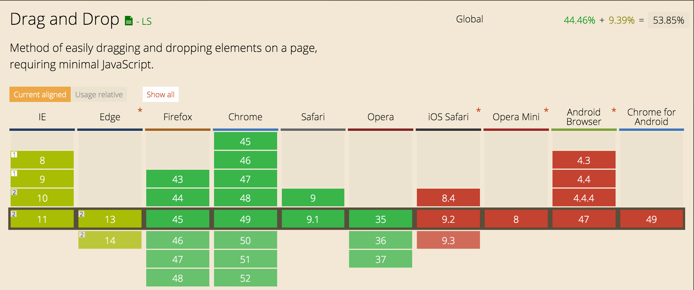

# Ik wil boodschappen-om-tostis-te-maken in mijn boodschappenlijstje kunnen gooien - Drag Drop

[link](http://tinyurl.com/leanderbt)

## een beschrijving van de feature(s)/Browser Technologies

Met de HTML5 api drag and drop kun je content verplaatsen en ergens droppen. Doormiddel van javascript kun je de events: drag, dagend, dragenter, dragexit, dragleave, dragover, dragstart en drop gebruiken. 

## welke browser de feature(s) wel/niet ondersteunen

Ios, Opra en Android ondersteunen deze api niet. IE en Edge maar gedeeltelijk.
Het is dus belangrijk om de API als feature te gebruiken, ik ben er dus eerst vanuit gegaan dat drag and drop er niet was.

##een beschrijving van de accessibility issues die zijn onderzocht

Ik ben bobile first begonnen met ontwerpen. omdat drag and drop niet wordt ondersteund op IOS, Android en Opra mini heb ik bij de mobiele layout geen rekening gehouden met drag and drop. 
Pas als de 2 kolommen naast elkaar komen te staan kan er pas drag and drop gebruikt worden.